# Smart-SSO

[](http://opensource.org/licenses/MIT)
[](#requirements)
[](#tech-stack)
[](https://github.com/a466350665/smart-sso/pulls)
[](https://github.com/a466350665/smart-sso)
[](https://gitee.com/a466350665/smart-sso)
[](https://gitcode.com/openjoe/smart-sso/overview)

[简体中文](README.md) | **English**

Smart-SSO is a lightweight **single sign-on and authorization center** built on Spring Boot 3 and the OAuth2 authorization-code flow. It ships SSO login/logout, silent token renewal, forced logout, button-level permissions and distributed deployment support — plus a zero-dependency demo mode that starts with a single command, no database required.

> The in-depth documentation under `docs/` is currently written in Chinese. This README is self-contained for evaluation: quick start, modules, configuration and verification are all covered below.

---

## Features

1. **Lightweight** — minimal implementation on Spring Boot 3 + OAuth2 authorization code, no extra moving parts.
2. **Single sign-on** — log in once on any client application, the rest follow.
3. **Single logout** — each client implicitly registers its own logout URI when fetching a token; logging out anywhere makes the server notify every related client to drop its local token.
4. **Silent renewal** — when the access token expires, the client backend refreshes it with the refresh token and extends the server-side stub, transparently to the user.
5. **Forced logout** — an administrator can terminate a user's session; the server revokes the credentials and notifies all related clients to clear their local sessions.
6. **Front/back-end separation** — cookie-less mode (token passed via header) with front-end driven refresh and redirect.
7. **Button-level permissions** — permissions are classified as menus or buttons and matched against the request URI, with per-application authorization isolation.
8. **Distributed deployment** — Redis-backed implementations for both server and client, sharing credentials and permissions across instances.

## Quick Start

### Requirements

| Component | Requirement |
| --- | --- |
| JDK | 17+ |
| Maven | 3.8+ |
| Database | **Not required** (embedded H2 by default); MySQL 5.7+/8.0 recommended for production |
| Redis | Optional (distributed deployment only) |

### Option 1 — Zero-dependency demo (recommended)

```bash
git clone https://github.com/a466350665/smart-sso.git
cd smart-sso
mvn -DskipTests package
java -jar smart-sso-server/target/smart-sso-server-2.0.1.jar
```

Open **http://localhost:8080** and sign in with the built-in account **`admin` / `123456`**.

- The `dev` profile is active by default: it uses an **in-memory H2** database and executes
  `smart-sso-server/src/main/resources/db/smart-sso.sql` on startup to create tables and seed demo data.
- Data lives only for the lifetime of the process — **restarting resets everything**, which is ideal for demos, integration work and automated tests.
- H2 console (dev only): <http://localhost:8080/h2-console> — JDBC URL `jdbc:h2:mem:smart_sso;MODE=MySQL;DB_CLOSE_DELAY=-1`, user `sa`, empty password.

### Option 2 — MySQL (production)

```bash
# 1. Create the schema and import (the script works for both MySQL and H2)
mysql -uroot -p -e "CREATE DATABASE IF NOT EXISTS \`smart-sso\` DEFAULT CHARSET utf8mb4"
mysql -uroot -p --default-character-set=utf8mb4 smart-sso < smart-sso-server/src/main/resources/db/smart-sso.sql

# 2. Adjust smart-sso-server/src/main/resources/application-prod.yaml, then start
java -jar smart-sso-server/target/smart-sso-server-2.0.1.jar --spring.profiles.active=prod
```

> The `prod` profile never runs the SQL script (`spring.sql.init.mode=never`), so startup cannot wipe your data.

### Client demo

```bash
java -jar smart-sso-demo/target/smart-sso-demo-2.0.1.jar   # port 8082, front/back-end separated sample
```

## Client Integration

Integrating a client takes three steps: add the `smart-sso-starter-client` dependency, configure `smart.sso.*`,
and let auto-configuration install the filters that handle interception and login redirects. Minimal configuration:

```yaml
smart:
  sso:
    server-url: http://localhost:8080   # required for a standalone client
    client-id: 1000                     # issued by the server after registering the app
    client-secret: xxxxxxxx
    exclude-urls: /static/*,/auth/*     # paths reachable without login
```

Full guide (dependency coordinates, filter behaviour, cookie-less mode, cross-domain setups, pitfalls):
see **[docs/client-integration.md](docs/client-integration.md)** (Chinese).

## Architecture

The example below uses two applications: after signing in on App A, visiting App B from the same browser requires no credentials.

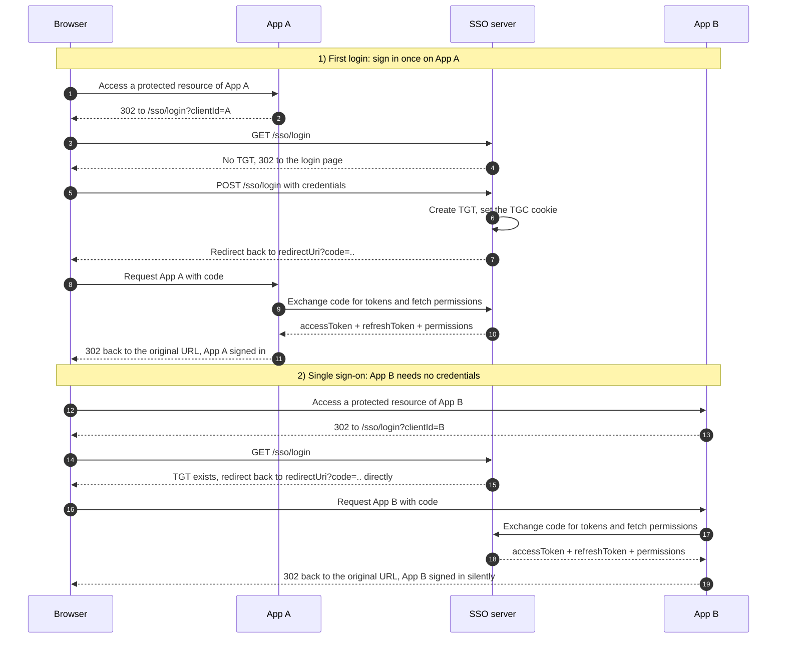

> Why App B needs no credentials: the browser carries the `TGC` cookie of the SSO domain, so the server recognises the existing global session (TGT) and issues an authorization code directly. Logout and renewal sequences: [docs/architecture.md](docs/architecture.md).

- **Protocol**: OAuth2 authorization code. The server keeps a global session (`TGT`, cookie name `TGC`); clients validate
  their own `accessToken` locally and use the `refreshToken` for renewal.
- **Two-step validation**: the user's identity is validated when issuing the authorization code, and the client's identity
  (ClientId/ClientSecret) when exchanging it for an access token — an application can never obtain another application's
  resource permissions.
- **Same-origin by default**: when `smart.sso.server-url` is left empty and the application *is* the SSO server, everything
  is same-origin — browser redirects use relative paths and server-to-server calls use a derived loopback address. A
  standalone client that forgets to configure it **fails fast at startup** instead of silently redirecting to itself.
- **Permission model**: after a URL is registered under *Permission Management*, requests whose path matches
  `sso_permission.url` exactly are protected; unregistered paths are allowed through.

Full protocol sequence, credential model and distributed setup: **[docs/architecture.md](docs/architecture.md)** (Chinese).

## Modules

```
smart-sso
├── smart-sso-server    -- SSO server + permission console (also a client of itself)
├── smart-sso-demo      -- front/back-end separated client integration sample
├── smart-sso-starter   -- auto-configuration modules (individually consumable)
│   ├── smart-sso-starter-base              -- shared constants, utilities, credential cleanup
│   ├── smart-sso-starter-client            -- client-side token lifecycle management
│   ├── smart-sso-starter-client-redis      -- Redis support for the client
│   ├── smart-sso-starter-server            -- server-side credential lifecycle management
│   └── smart-sso-starter-server-redis      -- Redis support for the server
└── verify/             -- functional verification suite (API + browser end-to-end)
```

| Branch | Stack | Notes |
| --- | --- | --- |
| `master` | Spring Boot 3.5.x + JDK 17 | Current line, version 2.0.x |
| `1.7` | Spring Boot 2.x + JDK 8 | Legacy maintenance branch |

## Tech Stack

| Technology | Version | Purpose |
| --- | --- | --- |
| spring-boot | 3.5.9 | Container + MVC |
| smart-stage | 2.0.2 | Base layer (Result/Page, MyBatis-Plus wiring) |
| mybatis-plus | 3.5.12 | ORM (managed by smart-stage) |
| H2 | 2.3.232 | Embedded in-memory database for the zero-dependency mode |
| mysql-connector-j | 9.5.0 | Production JDBC driver (managed by Spring Boot) |
| spring-boot-starter-data-redis | 3.5.9 | Shared credentials for distributed deployments |
| httpclient | 4.5.14 | Authorization-code exchange between client and server |
| Front-end | static SPA | Ace Admin + jQuery + zTree (no template engine) |

## Configuration Cheat Sheet

| Property | Default | Description |
| --- | --- | --- |
| `smart.sso.server-url` | empty | Authentication center URL; **empty = same-origin** (only when this app is also the server) |
| `smart.sso.client-id` / `client-secret` | — | Client credentials, issued by the server |
| `smart.sso.exclude-urls` | — | Paths bypassing login; a trailing `/*` means prefix match |
| `smart.sso.server.timeout` | 7200 | Global session (TGT) timeout, seconds |
| `smart.sso.server.access-token-timeout` | 1800 | Access token timeout, seconds |
| `mybatis-plus.global-config.db-config.table-prefix` | `sso_` | Table name prefix |
| `spring.profiles.active` | `dev` | `dev` = H2 in-memory, `prod` = MySQL |

Full reference: **[docs/configuration.md](docs/configuration.md)** (Chinese).

## Screenshots

| Sign-in page | Console home |
| --- | --- |
| 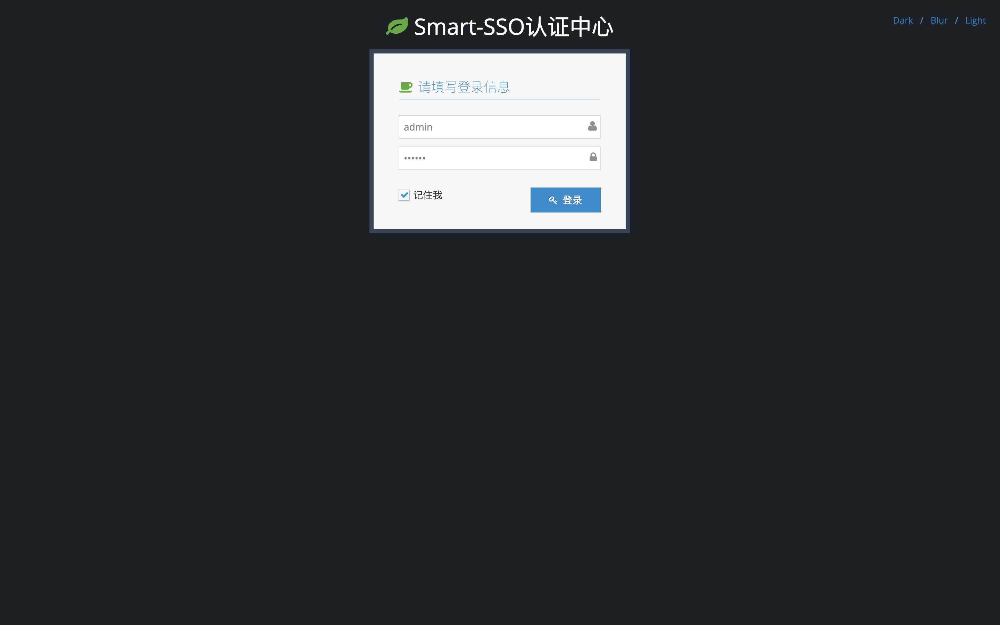 | 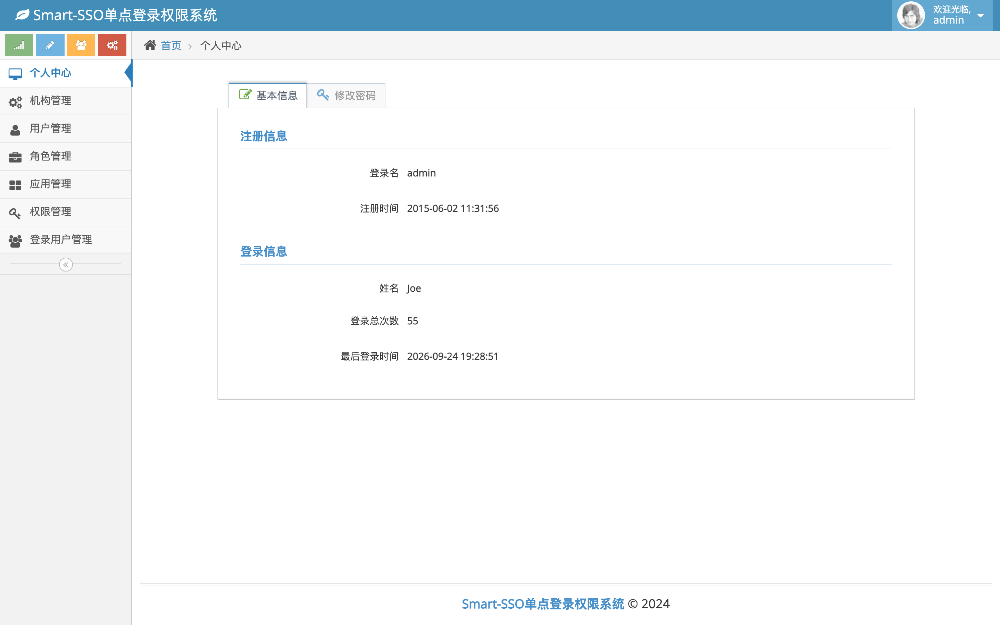 |

| Organization management | Organization editor (parent pre-selected) |
| --- | --- |
| 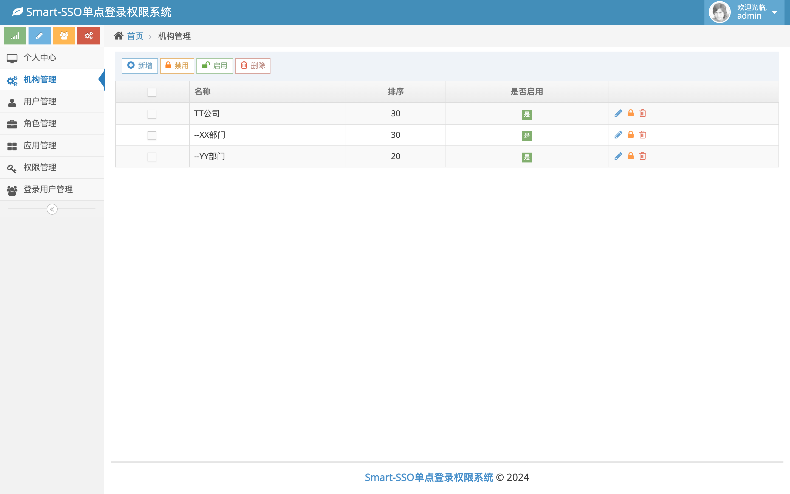 | 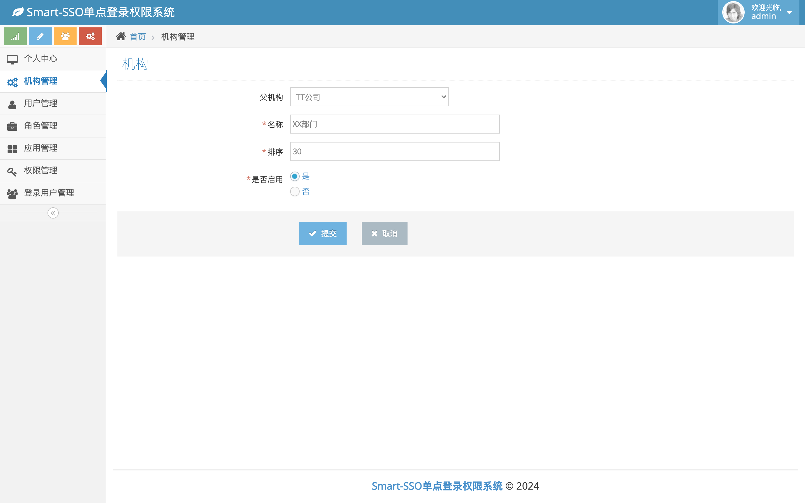 |

| User management (organization tree) | Role authorization (granted permissions pre-checked) |
| --- | --- |
| 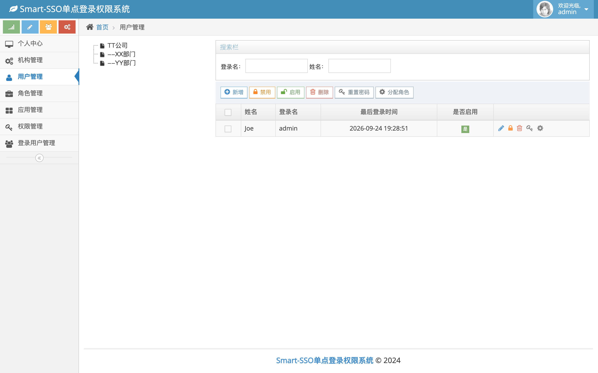 | 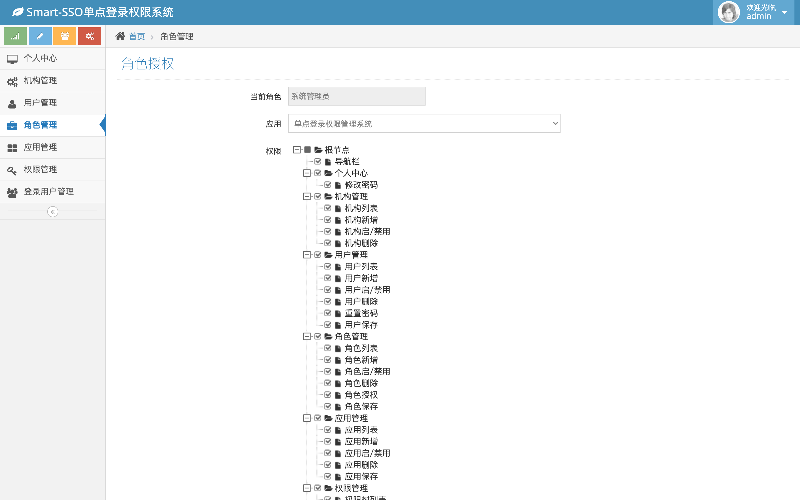 |

| Permission management | Application management |
| --- | --- |
| 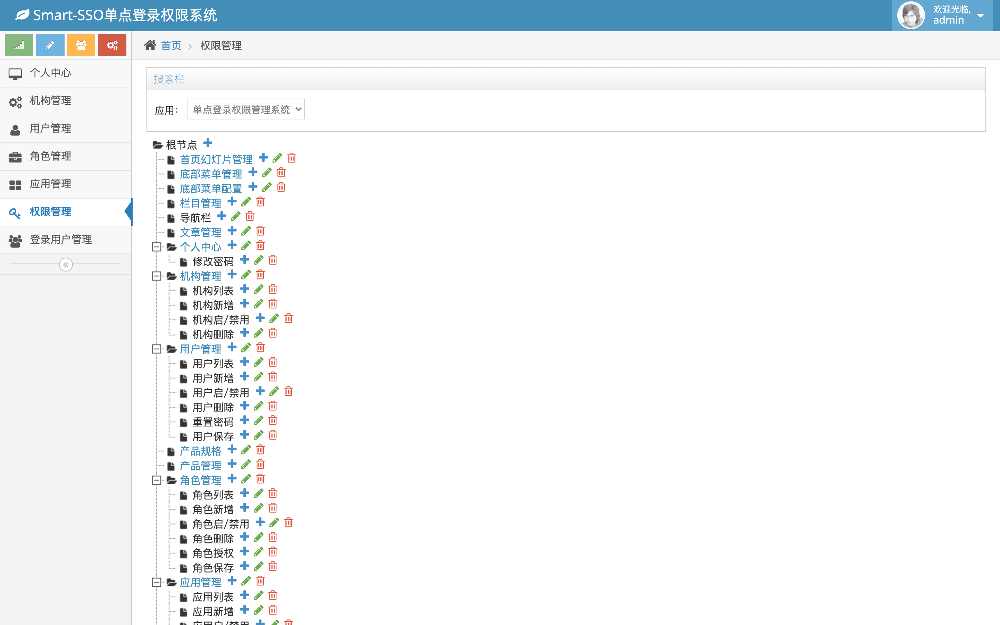 | 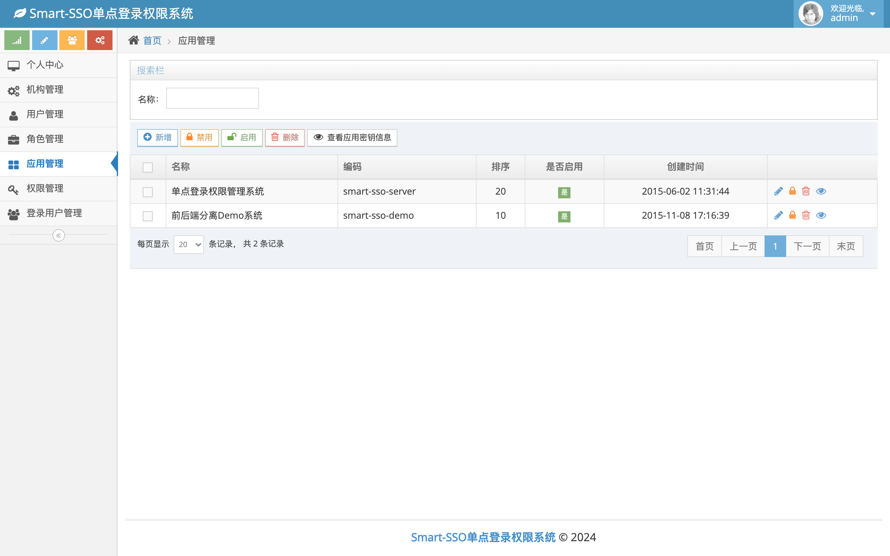 |

| Role management | Online users |
| --- | --- |
| 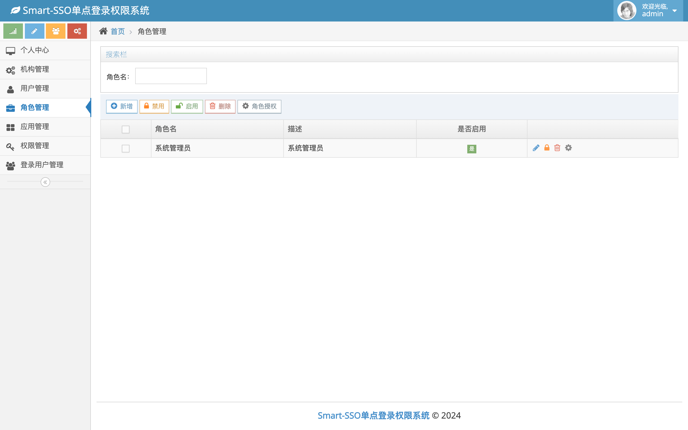 | 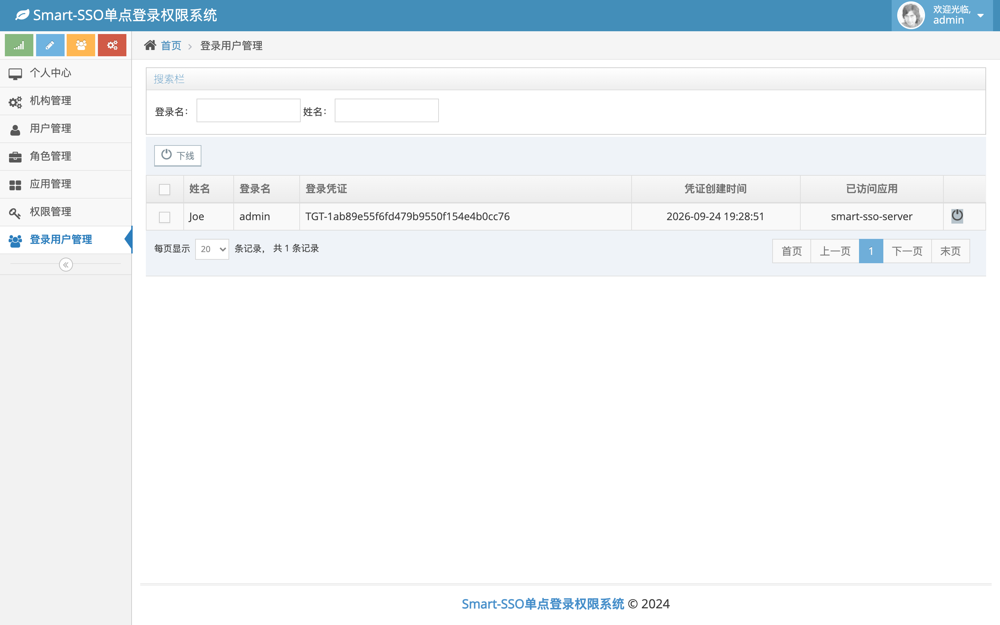 |

## Build & Verification

```bash
# Build (works offline once the local repository is populated)
mvn -o -DskipTests clean package

# Server-side suite: build + start dev/H2 + protocol/security/API/CRUD assertions (exit code is the result)
verify/verify.sh

# Front-end suite: real browser (local Chrome) end-to-end
cd verify/e2e && npm install && BASE=http://127.0.0.1:8080 node front.mjs
```

Coverage: startup and profile wiring, the SSO protocol main path, unauthenticated/unauthorized branches, all read-only
APIs, CRUD plus cascade deletion across the five admin modules, and browser-level rendering/interaction assertions.
Currently **64 server-side assertions + 31 browser assertions** pass. See **[docs/development.md](docs/development.md)** (Chinese).

## Contributing

Issues and pull requests are welcome. Please read [docs/development.md](docs/development.md) first, and run
`verify/verify.sh` locally before submitting — the protocol and business cases should all pass.

## Community

QQ groups: 454343484, 769134727

## License

[MIT](LICENSE) © 2020 Joe
