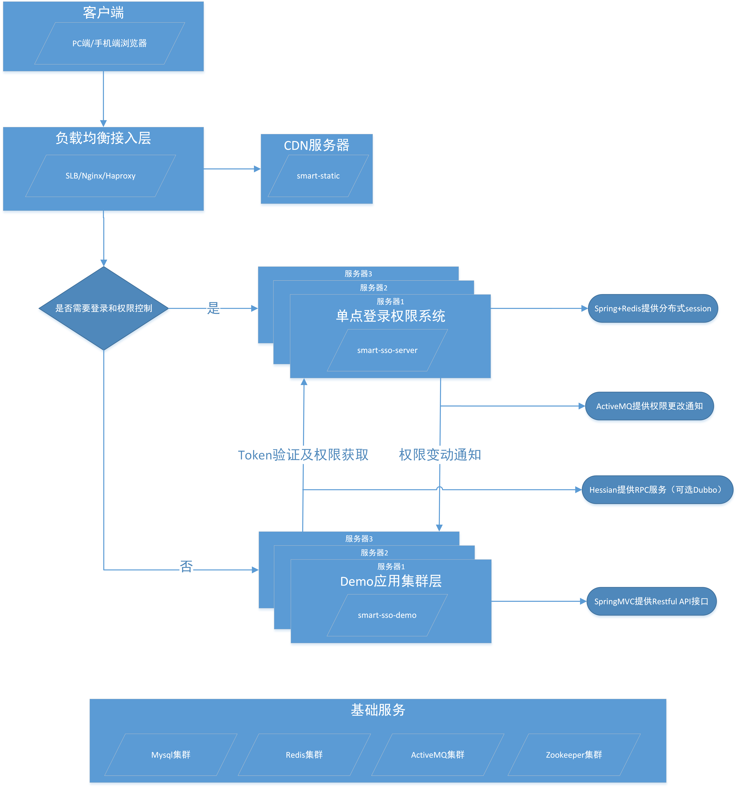
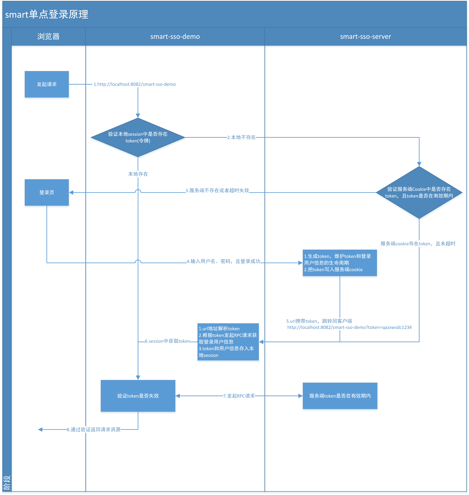
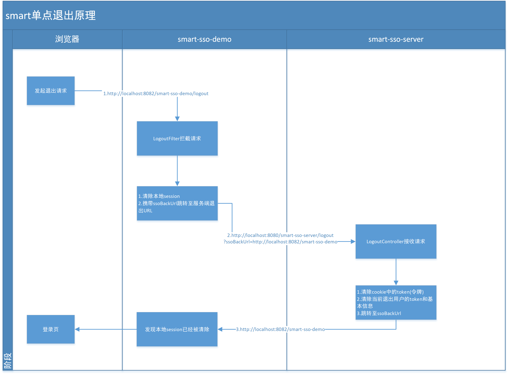
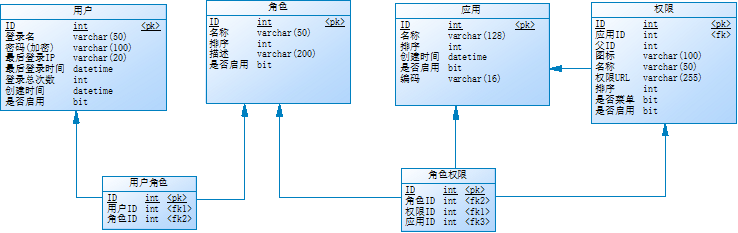

# Smart
[](http://opensource.org/licenses/MIT)
[](https://github.com/a466350665/smart/pulls)
[](https://github.com/a466350665/smart)
[](https://github.com/a466350665/smart)

QQ交流群：454343484（提供开发工具下载）

## 简述
    Smart定位用当下最流行的SSM（SpringMVC + Spring + Mybatis）技术，为您构建一个易理解、高可用、高扩展性的单点登录权限管理应用基层，方便实现快速开发。权限按钮级（可控制到Controller中方法）、修改实时生效（MQ广播实现）、支持分布式（Spring + Redis提供分布式Session）。
 
## 部署文档
[Java单点登录权限系统（二）—部署文档](http://blog.csdn.net/a466350665/article/details/79628553)

## 组织结构

``` lua
smart
├── smart-mvc -- 公共核心模块（SpringMVC + Spring + Mybatis）
├── smart-sso -- 单点登录权限系统
├───── smart-sso-client -- 客户端依赖包，提供登录认证、授权管理
├───── smart-sso-demo -- 客户端
├───── smart-sso-server -- 服务端
```

## 技术选型

### 后端
- JDK：1.8（支持1.6+）
- 数据库：Mysql
- 项目构建工具：Maven 3.3.3
- API文档：Springfox-Swagger2 2.6.1
- MVC框架：SpringMVC 4.2.1.RELEASE
- 核心框架：Spring 4.2.1.RELEASE
- ORM框架：MyBatis 3.3.0
- 分布式协调服务：Zookeeper 3.4.7
- 分布式RPC服务：Dubbo 2.5.3（默认Hessian 4.0.38）
- 分布式缓存服务：Redis 2.8.12
- 分布式消息服务：ActiveMQ 5.13.3
- NIO框架：Netty 4.0.23.Final
- JSON工具：Fastjson 1.2.29
- 数据库连接池：Druid 1.0.15
- 日志管理：SLF4J 1.7.21、Logback 1.1.7
- 单点登录：极简基于Cookie实现

### 前端
- 基础代码库：Jquery 2.1.1
- 前端模板：Ace 1.3.3(Bootstrap) https://github.com/bopoda/ace

### 浏览器兼容
- Internet Explorer 11
- Internet Explorer 10
- Internet Explorer 9
- Internet Explorer 8
- Google Chrome 14+
- Firefox 5+
- Safari 5
- Opera 11
- 手机浏览器兼容

## 对比Cas + Shiro

### 请求协议
- Cas：默认https，如果使用http需要把cas server解压修改配置参数。<br>
- Smart：默认http，可选配为Https，减少配置，降低门槛。

### 配置层面
- Cas：在web.xml中指定的TicketValidationFilter、AuthenticationFilter及SingleSignOutFilter存在重复的serverName参数，serverName的修改，需要分别修改三处。<br>
- Smart：将serverName定义在properties文件中，通过Spring的<context:property-placeholder />标签注入，简化配置。(毕竟当今大部分Java项目都会用到Spring框架)

### 耦合度
- Shiro：大家更多是熟悉通过annotation或者配置文件的方式去控制权限，有相对较低的耦合。<br>
- Smart：将权限集中管理在权限系统，需要的时候配置Filter，几乎无耦合。

### 权限变动服务重启
- Shiro：通过annotation或者配置文件配置的权限，修改都需要重启服务。<br>
- Smart：权限的修改通过MQ广播（可选配），服务无需重启。

### 分布式部署
- Shiro：通常大家部署依赖Shiro注入的RedisSession。<br>
- Smart：通过大家更为常用的Spring，覆盖HttpSession注入RedisSession。

注：Cas和Shiro的风光伟绩就无需笔者在此多加吹捧，现在只是关起门来聊聊Smart的优势，当然个人的理解和知识面也有限，有描述不对的地方，也欢迎大家加群探讨。友善！勿喷！谢谢！

## 架构图


## 单点登录原理


## 单点退出原理

    
## 数据库模型


## 效果展示

### 代码展示


### API文档


### Dubbo监控页


### 单点登录页


### 权限管理页


### 手机浏览器展示


## 作者寄语
艺术的做好一件擅长的事情
