# smart-sso
[](http://opensource.org/licenses/MIT)
[](https://github.com/a466350665/smart-sso/pulls)
[](https://github.com/a466350665/smart-sso)
[](https://github.com/a466350665/smart-sso)

QQ交流群：454343484、769134727

## 简述
    smart-sso使用当下最流行的SpringBoot技术，基于Cookie + OAuth2认证授权 + RBAC权限设计，为您构建一个轻量级、易理解、高可用、高扩展性的单点登录权限管理应用基层。

## 相关文档
- [smart-sso单点登录（一）：介绍](https://blog.csdn.net/a466350665/article/details/54140411)
- [smart-sso单点登录（二）：快速开始](https://blog.csdn.net/a466350665/article/details/79628553)
- [smart-sso单点登录（三）：接入指南](https://blog.csdn.net/a466350665/article/details/139736085)
- [smart-sso单点登录（四）：支持分布式](https://blog.csdn.net/a466350665/article/details/109388429)

## 功能说明

1. **轻量级：** 借鉴业界CAS原理，基于SpringBoot和OAuth2协议的授权码模式极简实现；

2. **跨域支持：** 服务端和客户端允许部署在不同域名下，实现跨域的单点登录访问机制；

3. **自动续约：** 使用Oauth2协议的token失效机制，通过refreshToken刷新时自动更新服务端凭证时效，完成自动续约；

4. **按钮级权限控制：** 服务端对权限进行菜单和按钮分类，通过请求的uri和请求方法匹配，实现按钮级权限控制；

5. **分布式部署：** 服务端和客户端都支持多实例部署场景，基于redis实现分布式Token管理；

## 技术选型

| 技术                   | 版本    | 说明             |
| ---------------------- | ------- | ---------------- |
| spring-boot             | 2.5.13   | 容器 + MVC框架     |
| spring-boot-starter-data-redis    | 2.5.13   | 分布式场景Token管理  |
| spring-boot-starter-freemarker | 2.5.13   | 模板引擎  |
| mybatis-plus-boot-starter           | 3.5.2   | ORM框架  |
| springfox-boot-starter      | 3.0.0   | 文档     |
| httpclient    | 4.5.14   | 授权码认证，客户端和服务端通信  |

## 数据库模型
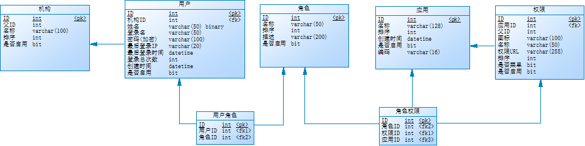

## 组件结构

```lua
smart-sso
├── smart-sso-demo -- 客户端示例
├── smart-sso-server -- 单点登录权限管理服务端
├── smart-sso-starter -- 依赖装配模块
│   ├── smart-sso-starter-base -- 公用的基础依赖装配
│   ├── smart-sso-starter-client -- 客户端依赖装配
│   ├── smart-sso-starter-client-redis -- 客户端依赖装配，分布式部署场景redis支持
│   ├── smart-sso-starter-server -- 服务端依赖装配
│   ├── smart-sso-starter-server-redis -- 服务端依赖装配，分布式部署场景redis支持
```

## 组件依赖关系

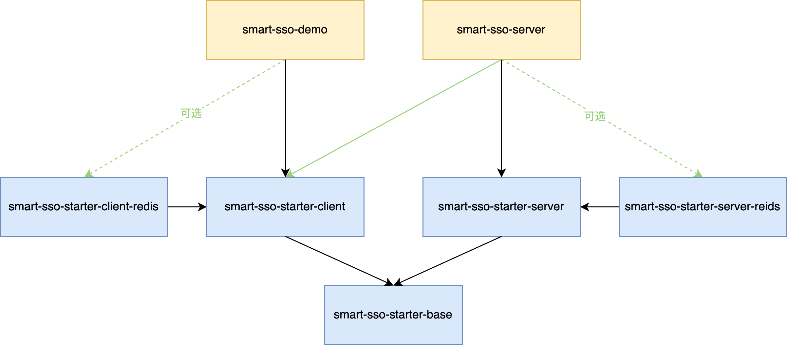

<font color="red">注意：</font>  
1.绿色实线可以理解服务端也需要单点登录，同样是其自身的一个客户端；  
2.绿色虚线表示无论是服务端还是客户端，当需要集群部署时，可选用Redis版本的依赖包来完成Token的共享存储；

## 单点登录原理


## 单点退出原理


## 效果展示
### 单点登录页
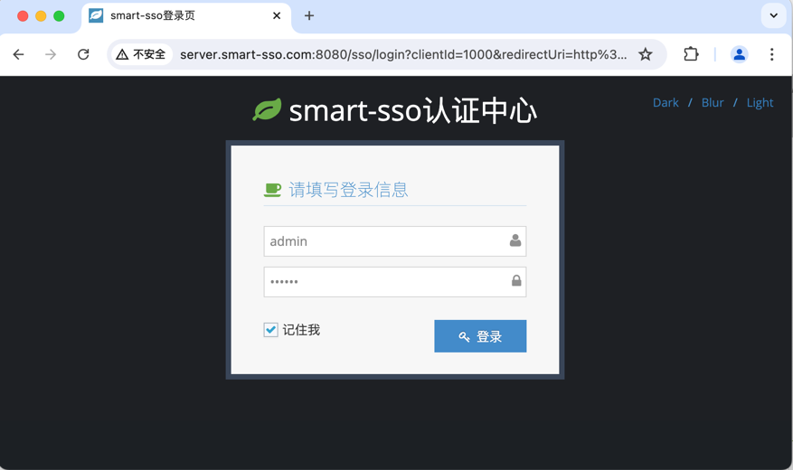

### 客户端示例登录成功页
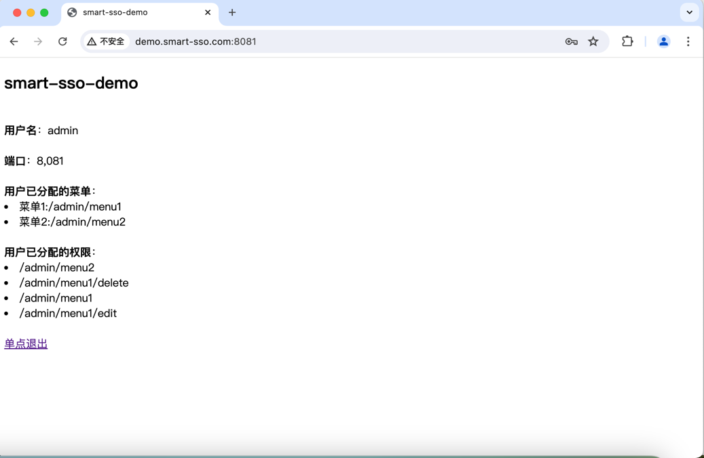

### 权限管理相关页
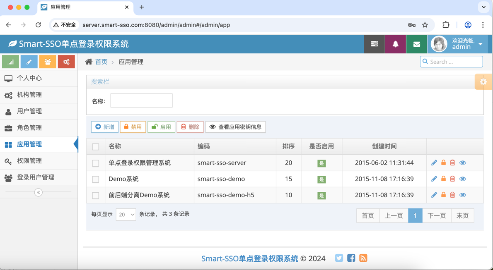

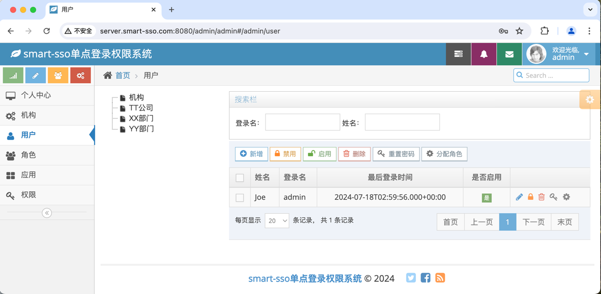

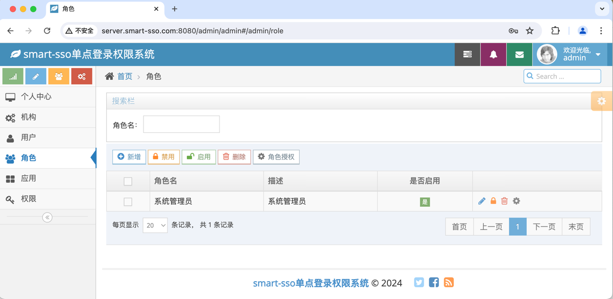

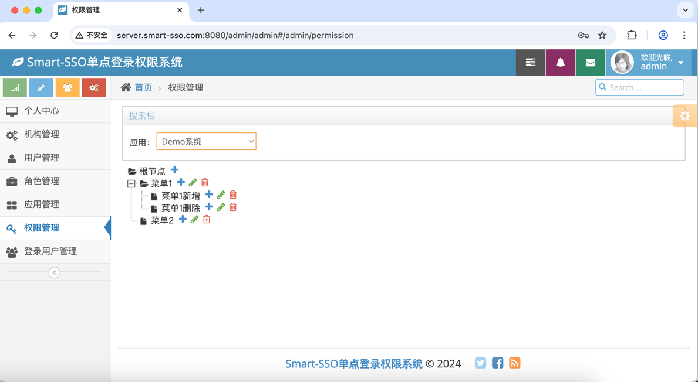

### 手机端效果
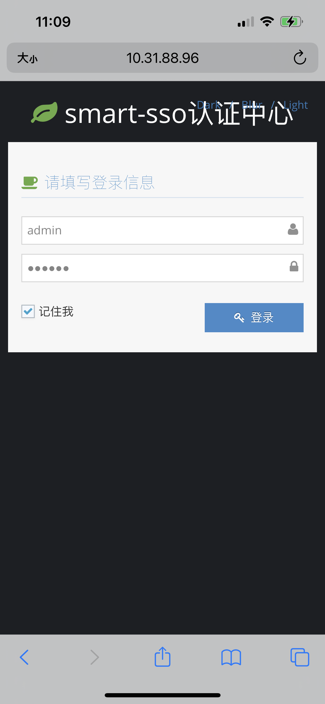

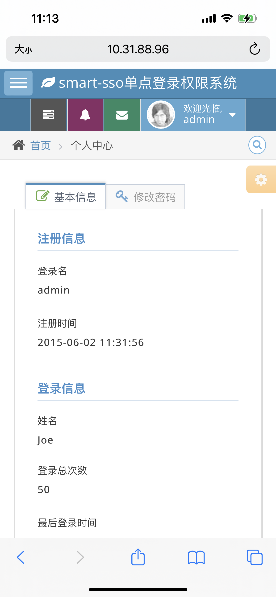

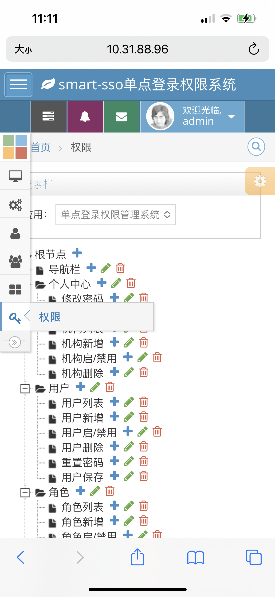

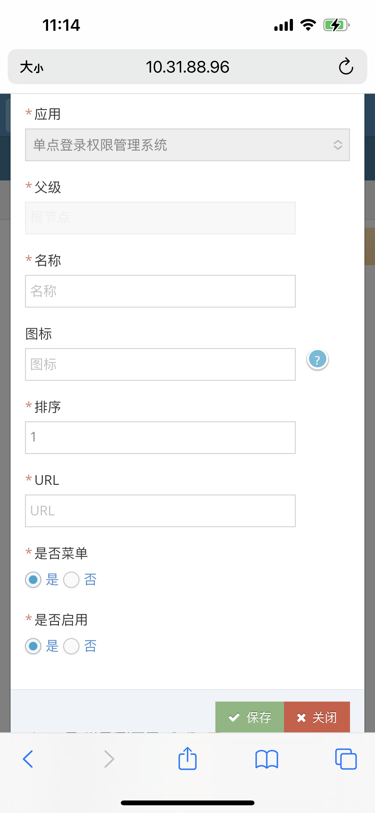