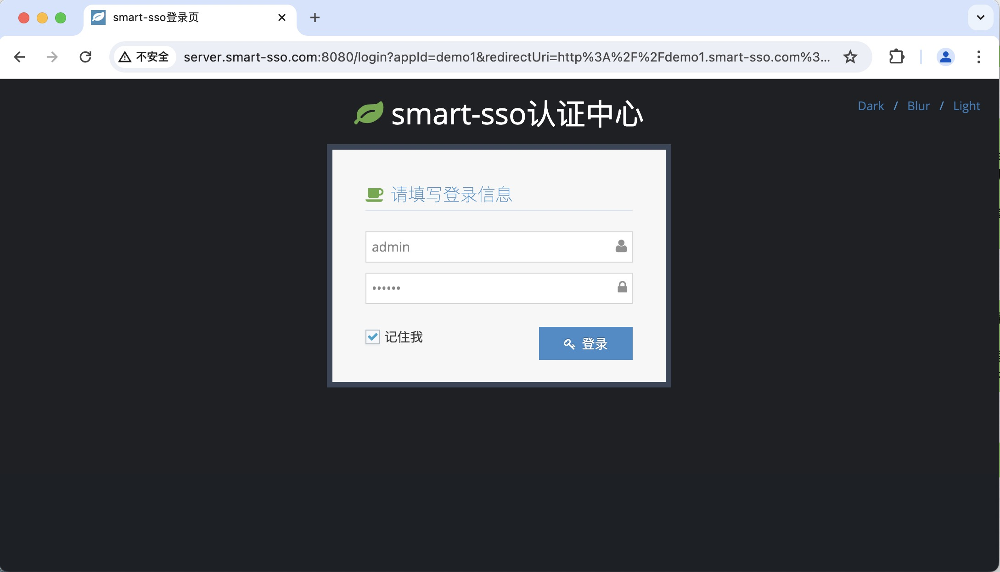
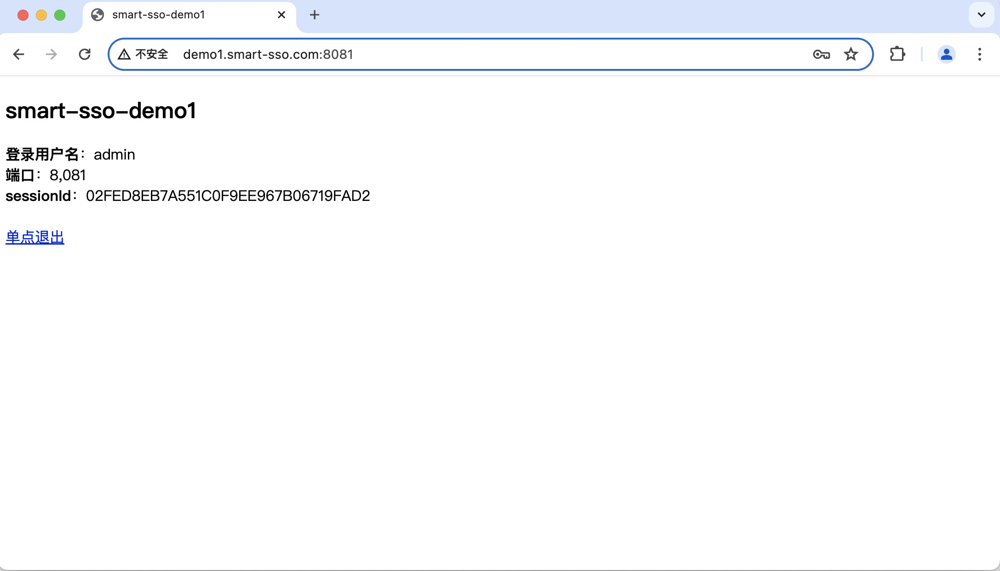

# smart-sso
[](http://opensource.org/licenses/MIT)
[](https://github.com/a466350665/smart-sso/pulls)
[](https://github.com/a466350665/smart-sso)
[](https://github.com/a466350665/smart-sso)

QQ交流群：454343484🈵、769134727

## 简述
    smart-sso使用当下最流行的SpringBoot技术，基于OAuth2认证授权协议，为您构建一个轻量级、易理解、高可用、高扩展性的分布式单点登录应用基础。

## 相关文档
- [smart-sso单点登录（一）：简介](https://blog.csdn.net/a466350665/article/details/54140411)
- [smart-sso单点登录（二）：部署文档](http://blog.csdn.net/a466350665/article/details/79628553)
- [smart-sso单点登录（三）：引入redis支持分布式](https://blog.csdn.net/a466350665/article/details/109388429)

## 组件结构

```lua
smart-sso
├── smart-sso-demo1 -- 客户端示例1
├── smart-sso-demo2 -- 客户端示例2
├── smart-sso-server -- 服务端
├── smart-sso-starter -- 依赖装配模块
│   ├── smart-stage-starter-base -- 公用的基础依赖装配
│   ├── smart-stage-starter-client -- 客户端依赖装配
│   ├── smart-stage-starter-client-redis -- 客户端依赖装配，分布式部署场景redis支持
│   ├── smart-stage-starter-server -- 服务端依赖装配
│   ├── smart-stage-starter-server-redis -- 服务端依赖装配，分布式部署场景redis支持
```

## 技术选型

| 技术                   | 版本    | 说明             |
| ---------------------- | ------- | ---------------- |
| spring-boot             | 2.5.13   | 容器 + MVC框架     |
| spring-boot-starter-data-redis    | 2.5.13   | 分布式场景Token管理  |
| httpclient    | 4.5.13   | 授权码认证，客户端和服务端通信  |

## 功能说明

1. **轻量级：** 借鉴业界CAS原理，基于SpringBoot和OAuth2协议的极简实现；

2. **跨域支持：** 服务端和客户端都支持不同域名的跨域单点登录访问机制；

3. **分布式部署：** 服务端和客户端都支持多实例部署场景，基于redis实现分布式Token管理；

4. **高度扩展性：** 服务端实现的简化版OAuth2协议和Token管理机制都允许自定义扩展覆盖。

## 单点登录原理


## 单点退出原理


## 效果展示
### 服务端登录页


### 客户端示例1登录成功页


### 客户端示例2登录成功页
