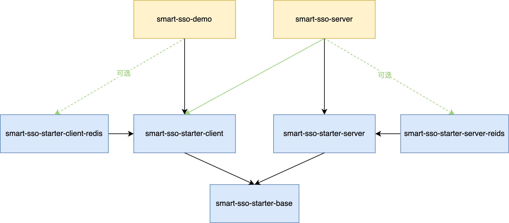
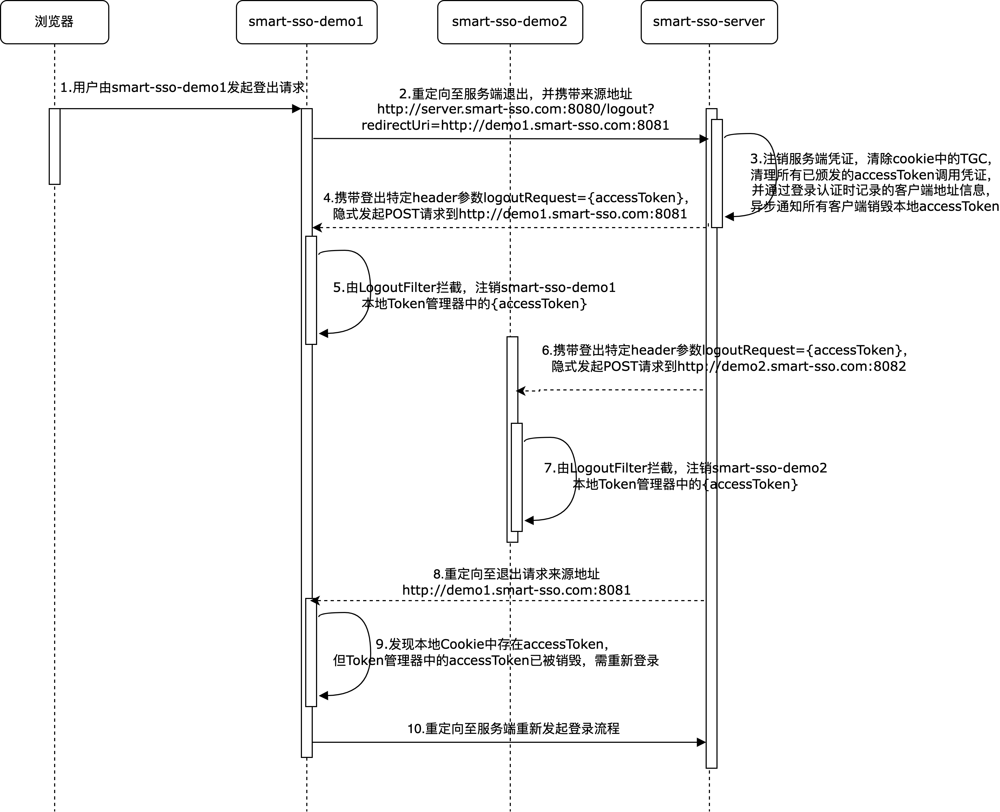
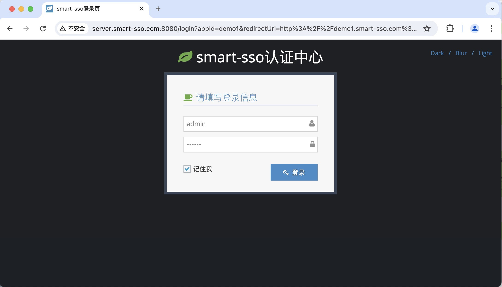
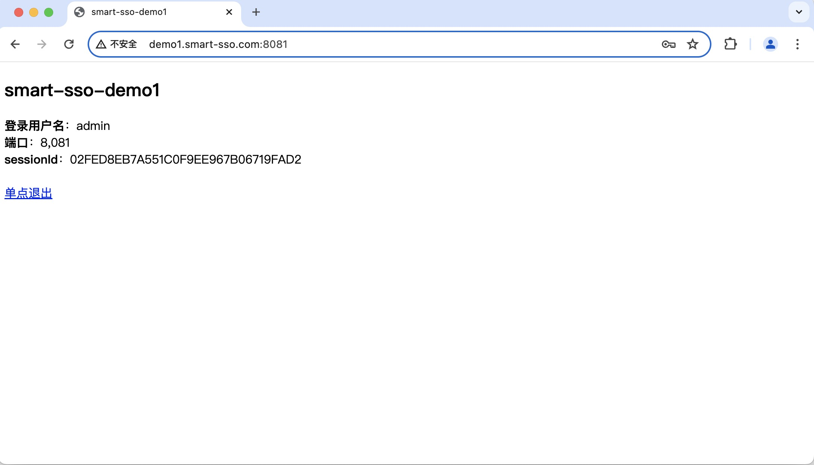
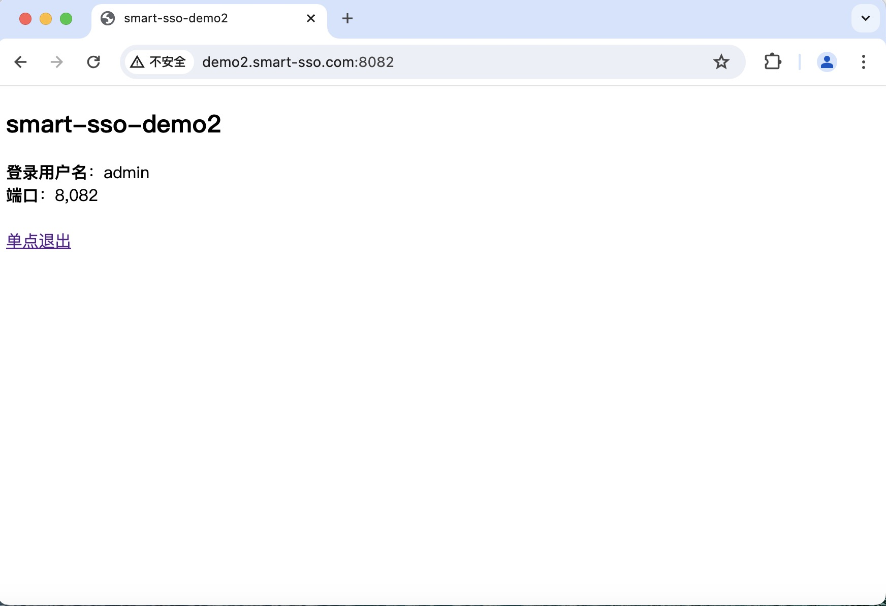

# smart-sso
[](http://opensource.org/licenses/MIT)
[](https://github.com/a466350665/smart-sso/pulls)
[](https://github.com/a466350665/smart-sso)
[](https://github.com/a466350665/smart-sso)

QQ交流群：454343484🈵、769134727

## 简述
    smart-sso使用当下最流行的SpringBoot技术，基于Cookie + OAuth2认证授权方式，为您构建一个轻量级、易理解、高可用、高扩展性的单点登录应用。

## 相关文档
- [smart-sso单点登录（一）：介绍](https://blog.csdn.net/a466350665/article/details/54140411)
- [smart-sso单点登录（二）：快速开始](https://blog.csdn.net/a466350665/article/details/79628553)
- [smart-sso单点登录（三）：接入指南](https://blog.csdn.net/a466350665/article/details/139736085)
- [smart-sso单点登录（四）：支持分布式](https://blog.csdn.net/a466350665/article/details/109388429)

## 组件结构

```lua
smart-sso
├── smart-sso-demo1 -- 客户端示例1
├── smart-sso-demo2 -- 客户端示例2
├── smart-sso-server -- 服务端
├── smart-sso-starter -- 依赖装配模块
│   ├── smart-sso-starter-base -- 公用的基础依赖装配
│   ├── smart-sso-starter-client -- 客户端依赖装配
│   ├── smart-sso-starter-client-redis -- 客户端依赖装配，分布式部署场景redis支持
│   ├── smart-sso-starter-server -- 服务端依赖装配
│   ├── smart-sso-starter-server-redis -- 服务端依赖装配，分布式部署场景redis支持
```

## 依赖关系



## 分支说明
- master: java8 + springboot 2.5
- jdk17: java17 + springboot 3.0

## 技术选型

| 技术                   | 版本    | 说明             |
| ---------------------- | ------- | ---------------- |
| spring-boot             | 3.0.7   | 容器 + MVC框架     |
| spring-boot-starter-data-redis    | 3.0.7   | 分布式场景Token管理  |
| httpclient    | 4.5.14   | 授权码认证，客户端和服务端通信  |

## 功能说明

1. **轻量级：** 借鉴业界CAS原理，基于SpringBoot和OAuth2协议的授权码模式极简实现；

2. **跨域支持：** 服务端和客户端允许部署在不同域名下，实现跨域的单点登录访问机制；

3. **分布式部署：** 服务端和客户端都支持多实例部署场景，基于redis实现分布式Token管理；

4. **自动续约：** 使用Oauth2协议的token失效机制，通过refreshToken刷新时自动更新服务端凭证时效，完成自动续约；

5. **高度扩展性：** 服务端包含简化版的OAuth2协议实现和凭证管理都允许自定义扩展覆盖。

## 单点登录原理


## 单点退出原理



## 效果展示
### 服务端登录页


### 客户端示例1登录成功页


### 客户端示例2登录成功页
