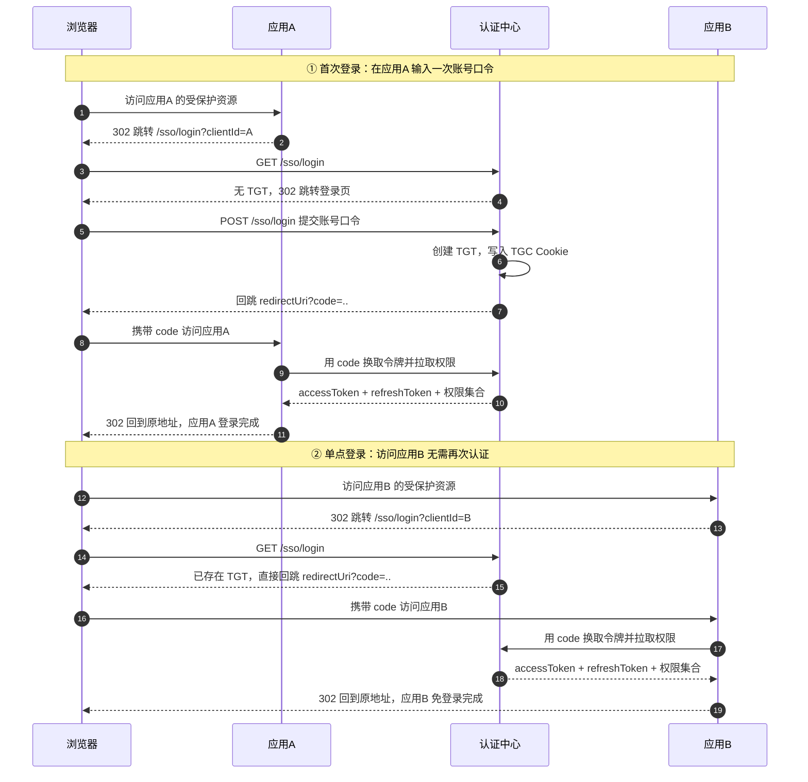

# Smart-SSO

[](http://opensource.org/licenses/MIT)
[](#环境要求)
[](#技术选型)
[](https://github.com/a466350665/smart-sso/pulls)
[](https://github.com/a466350665/smart-sso)
[](https://github.com/a466350665/smart-sso)
[](https://gitee.com/a466350665/smart-sso)
[](https://gitcode.com/openjoe/smart-sso/overview)

**简体中文** | [English](README.en.md)

Smart-SSO 是一个基于 Spring Boot 3 + OAuth2 授权码模式的**轻量级单点登录与权限认证中心**：提供单点登录/退出、自动续签、强制下线、按钮级权限与分布式部署能力，并内置开箱即用的演示环境——不装数据库也能一条命令跑起来。

- 📖 文档：[快速开始](#快速开始) · [接入指南](docs/client-integration.md) · [架构与原理](docs/architecture.md) · [配置参考](docs/configuration.md) · [常见问题](docs/faq.md)
- 💬 交流群：454343484、769134727

---

## 特性

1. **轻量级** —— 基于 Spring Boot 3 与 OAuth2 授权码模式的极简实现，无多余依赖。
2. **单点登录** —— 任意客户端登录一次，其余客户端免登录。
3. **单点退出** —— 客户端获取 Token 时隐性上报自身注销地址，任一客户端退出即由服务端远程通知全部客户端注销本地 Token。
4. **自动续签** —— accessToken 过期由客户端后端自动调用 refreshToken 刷新，并同步延长服务端凭证存根时效，用户无感。
5. **踢人下线** —— 管理员可终止指定用户会话，服务端立即吊销凭证并回调通知所有关联客户端清除本地会话。
6. **前后端分离** —— 支持无 Cookie 模式（Token 走 Header），前端自行处理刷新与跳转。
7. **按钮级权限** —— 权限分菜单/按钮两类，按请求 URI 精确匹配做按钮级控制，并支持按应用隔离授权。
8. **分布式部署** —— 服务端与客户端均提供 Redis 实现，支持多实例共享凭证与权限。

## 快速开始

### 环境要求

| 组件 | 要求 |
| --- | --- |
| JDK | 17+ |
| Maven | 3.8+ |
| 数据库 | **无需**（默认内置 H2 内存库）；生产建议 MySQL 5.7+/8.0 |
| Redis | 可选（仅分布式部署需要） |

### 方式一：零依赖体验（推荐先跑这个）

```bash
git clone https://github.com/a466350665/smart-sso.git
cd smart-sso
mvn -DskipTests package
java -jar smart-sso-server/target/smart-sso-server-2.0.1.jar
```

浏览器打开 **http://localhost:8080** ，使用内置账号 **`admin` / `123456`** 登录。

- 默认激活 `dev` profile：使用**内存 H2**，启动时自动执行 `smart-sso-server/src/main/resources/db/smart-sso.sql` 建表并写入演示数据（应用、机构、角色、权限、用户）。
- 数据仅存在于进程生命周期内，**重启即回到初始状态**，适合演示、联调与自动化测试。
- H2 控制台（仅 dev）：<http://localhost:8080/h2-console>，JDBC URL `jdbc:h2:mem:smart_sso;MODE=MySQL;DB_CLOSE_DELAY=-1`，用户名 `sa`，密码留空。

### 方式二：MySQL（生产）

```bash
# 1. 建库并导入（脚本为跨库脚本，MySQL / H2 通用）
mysql -uroot -p -e "CREATE DATABASE IF NOT EXISTS \`smart-sso\` DEFAULT CHARSET utf8mb4"
mysql -uroot -p --default-character-set=utf8mb4 smart-sso < smart-sso-server/src/main/resources/db/smart-sso.sql

# 2. 按需修改 smart-sso-server/src/main/resources/application-prod.yaml 的连接信息后启动
java -jar smart-sso-server/target/smart-sso-server-2.0.1.jar --spring.profiles.active=prod
```

> `prod` profile **不会**自动执行数据库脚本（`spring.sql.init.mode=never`），避免误删数据。

### 客户端示例

```bash
java -jar smart-sso-demo/target/smart-sso-demo-2.0.1.jar   # 端口 8082，前后端分离示例
```

## 接入指南（客户端）

客户端只需三步：引入 `smart-sso-starter-client`、配置 `smart.sso.*`、由客户端依赖自动装配过滤器完成拦截与登录跳转。最小配置：

```yaml
smart:
  sso:
    server-url: http://localhost:8080   # 独立客户端必填
    client-id: 1000                     # 在服务端「应用管理」登记后获得
    client-secret: xxxxxxxx
    exclude-urls: /static/*,/auth/*     # 无需登录即可访问的路径
```

完整步骤（依赖坐标、过滤器行为、前后端分离模式、跨域场景、常见坑）见 **[docs/client-integration.md](docs/client-integration.md)**。

## 架构与原理

下面以两个应用为例：应用A 首次登录后，应用B 由同一个浏览器访问即可免登录（单点登录）。


```mermaid
sequenceDiagram
    autonumber
    participant B as 浏览器
    participant A as 应用A
    participant S as 认证中心
    participant X as 应用B

    Note over B,X: ① 首次登录：在应用A 输入一次账号口令
    B->>A: 访问应用A 的受保护资源
    A-->>B: 302 跳转 /sso/login?clientId=A
    B->>S: GET /sso/login
    S-->>B: 无 TGT，302 跳转登录页
    B->>S: POST /sso/login 提交账号口令
    S->>S: 创建 TGT，写入 TGC Cookie
    S-->>B: 回跳 redirectUri?code=..
    B->>A: 携带 code 访问应用A
    A->>S: 用 code 换取令牌并拉取权限
    S-->>A: accessToken + refreshToken + 权限集合
    A-->>B: 302 回到原地址，应用A 登录完成

    Note over B,X: ② 单点登录：访问应用B 无需再次认证
    B->>X: 访问应用B 的受保护资源
    X-->>B: 302 跳转 /sso/login?clientId=B
    B->>S: GET /sso/login
    S-->>B: 已存在 TGT，直接回跳 redirectUri?code=..
    B->>X: 携带 code 访问应用B
    X->>S: 用 code 换取令牌并拉取权限
    S-->>X: accessToken + refreshToken + 权限集合
    X-->>B: 302 回到原地址，应用B 免登录完成
```


- **协议**：OAuth2 授权码模式。服务端维护全局会话 `TGT`（Cookie，默认名 `TGC`），客户端凭 `accessToken` 本地校验，`refreshToken` 用于续签。
- **两级校验**：授权码阶段校验用户身份，换取 accessToken 阶段校验客户端身份（ClientId/ClientSecret），可避免越权获取其他应用的资源权限。
- **同源即免配**：`smart.sso.server-url` 留空时，本应用若同时是服务端则自动按“同源”工作——页面跳转走相对路径，服务端之间的调用走本机推导地址；独立客户端漏配则**启动失败**，不会静默跳错。
- **权限模型**：在「权限管理」登记 URL 后，请求路径与 `sso_permission.url` 精确匹配即受控；未登记的路径放行。

协议时序、凭证模型、分布式（Redis）与前后端分离的完整说明见 **[docs/architecture.md](docs/architecture.md)**。

## 模块与版本

```
smart-sso
├── smart-sso-server    -- 单点登录权限管理服务端（同时是自身的客户端）
├── smart-sso-demo      -- 前后端分离客户端接入示例
├── smart-sso-starter   -- 依赖装配模块（可单独引入到你的应用）
│   ├── smart-sso-starter-base              -- 公共常量、工具、凭证清理机制
│   ├── smart-sso-starter-client            -- 客户端依赖包，客户端 Token 生命周期管理
│   ├── smart-sso-starter-client-redis      -- 客户端 Redis 装配，分布式部署支持
│   ├── smart-sso-starter-server            -- 服务端依赖包，服务端凭证生命周期管理
│   └── smart-sso-starter-server-redis      -- 服务端 Redis 装配，分布式部署支持
└── verify/             -- 功能验证套件（接口 + 浏览器端到端）
```

| 分支 | 技术栈 | 说明 |
| --- | --- | --- |
| `master` | Spring Boot 3.5.x + JDK 17 | 当前主版本，版本号 2.0.x |
| `1.7` | Spring Boot 2.x + JDK 8 | 旧版本维护分支 |

## 技术选型

| 技术 | 版本 | 说明 |
| --- | --- | --- |
| spring-boot | 3.5.9 | 容器 + MVC 框架 |
| smart-stage | 2.0.2 | 底座（Result/Page、MyBatis-Plus 装配等） |
| mybatis-plus | 3.5.12 | ORM 框架（由 smart-stage 管理） |
| H2 | 2.3.232 | 内置内存库，零依赖体验 |
| mysql-connector-j | 9.5.0 | 生产数据库驱动（由 Spring Boot 管理） |
| spring-boot-starter-data-redis | 3.5.9 | 分布式场景凭证共享 |
| httpclient | 4.5.14 | 授权码认证，客户端与服务端通信 |
| 前端 | 静态 SPA | Ace Admin + jQuery + zTree（非模板引擎） |

## 配置速查

| 配置项 | 默认值 | 说明 |
| --- | --- | --- |
| `smart.sso.server-url` | 空 | 认证中心地址；**留空=同源**（仅当本应用同时是服务端） |
| `smart.sso.client-id` / `client-secret` | — | 客户端身份，在服务端「应用管理」登记 |
| `smart.sso.exclude-urls` | — | 免登录路径；以 `/*` 结尾表示前缀匹配 |
| `smart.sso.server.timeout` | 7200 | 全局会话 TGT 超时（秒） |
| `smart.sso.server.access-token-timeout` | 1800 | accessToken 超时（秒） |
| `mybatis-plus.global-config.db-config.table-prefix` | `sso_` | 表名前缀 |
| `spring.profiles.active` | `dev` | `dev`=H2 内存库；`prod`=MySQL |

完整配置项（含 `url-patterns`、`logout-path`、`cookie-name`、`code-timeout`、分页方言等）见 **[docs/configuration.md](docs/configuration.md)**。

## 效果展示

| 登录页 | 管理台首页 |
| --- | --- |
|  |  |

| 机构管理 | 机构编辑（父机构默认回显） |
| --- | --- |
|  |  |

| 用户管理（含机构树） | 角色授权（权限树回显已授权） |
| --- | --- |
|  |  |

| 权限管理 | 应用管理 |
| --- | --- |
|  |  |

| 角色管理 | 在线用户 |
| --- | --- |
|  |  |

## 开发与验证

```bash
# 构建（离线亦可，本地仓库需已具备依赖）
mvn -o -DskipTests clean package

# 服务端验证：构建 + 启动 dev/H2 + 协议/安全/接口/业务 CRUD 断言（退出码即结论）
verify/verify.sh

# 前端验证：真实浏览器（本机 Chrome）端到端
cd verify/e2e && npm install && BASE=http://127.0.0.1:8080 node front.mjs
```

验证套件覆盖：构建与启动、SSO 协议主链路、未登录/无权限分支、只读接口全量、五大模块 CRUD 与级联删除、前端页面渲染与交互（含浏览器端断言）。当前 **服务端 64 项断言 + 前端 31 项断言**全部通过。详见 **[docs/development.md](docs/development.md)**。

## 文档

| 文档 | 内容 |
| --- | --- |
| [docs/why-oauth2.md](docs/why-oauth2.md) | 为什么选择 OAuth2：与传统 Token、JWT 的对比与取舍 |
| [docs/architecture.md](docs/architecture.md) | 架构与原理：协议时序、凭证模型、分布式、前后端分离 |
| [docs/client-integration.md](docs/client-integration.md) | 客户端接入指南：依赖、配置、过滤器行为、常见问题 |
| [docs/configuration.md](docs/configuration.md) | 配置参考与数据库脚本说明 |
| [docs/development.md](docs/development.md) | 本地开发、构建、目录约定与验证套件 |
| [docs/faq.md](docs/faq.md) | 常见问题 |

## 参与贡献

欢迎提交 Issue 与 Pull Request。参与前请先阅读 [docs/development.md](docs/development.md) 了解构建与验证方式；提交前建议本地跑一遍 `verify/verify.sh`，确保协议与业务用例全部通过。

## 交流

QQ 交流群：454343484、769134727

## License

[MIT](LICENSE) © 2020 Joe
