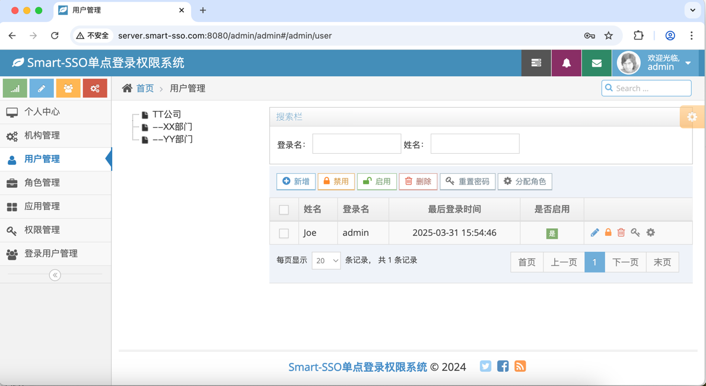

# Smart-SSO
[](http://opensource.org/licenses/MIT)
[](https://github.com/a466350665/smart-sso/pulls)
[](https://github.com/a466350665/smart-sso)
[](https://github.com/a466350665/smart-sso)
[](https://gitee.com/a466350665/smart-sso)
[](https://gitee.com/a466350665/smart-sso)
[](https://gitcode.com/openjoe/smart-sso/overview)


QQ交流群：454343484、769134727

## 简述
Smart-SSO 依托当下备受青睐的 SpringBoot 技术，以 OAuth2 认证结合 RBAC 权限设计为基础，为您塑造一个轻量级、高可用的单点认证授权中心。

## 功能说明

1. **轻量级：** 基于SpringBoot和OAuth2协议的授权码模式极简实现；

2. **单点退出：** 客户端应用在获取Token时，隐性把自身的注销地址传递给服务端，在任意客户端应用操作退出，服务端通过远程通知所有客户端应用注销本地Token，完成单点退出；

3. **自动续签：** 使用OAuth2协议的accessToken策略，过期由客户端后端自动调用refreshToken刷新接口，并更新服务端凭证存根时效，完成过期自动续签；

4. **跨域支持：** 服务端和客户端允许在不同域名下，完成跨域的单点登录和退出机制；

5. **前后端分离：** 用户在前后端分离的架构下(无Cookie模式)，也能轻易实现单点登录的相关功能；

6. **按钮级权限：** 服务端对权限进行菜单和按钮分类，通过请求uri和请求方法匹配的方式实现权限按钮级控制；

7. **分布式部署：** 服务端和客户端都支持基于Redis共享Token的多实例部署场景；

## 相关文档
- [Smart-SSO单点登录（一）：介绍](https://blog.csdn.net/a466350665/article/details/54140411)
- [Smart-SSO单点登录（二）：快速开始](https://blog.csdn.net/a466350665/article/details/79628553)
- [Smart-SSO单点登录（三）：接入指南](https://blog.csdn.net/a466350665/article/details/139736085)
- [Smart-SSO单点登录（四）：前后端分离](https://blog.csdn.net/a466350665/article/details/109742638)
- [Smart-SSO单点登录（五）：分布式部署](https://blog.csdn.net/a466350665/article/details/109388429)

## 代码托管
**Github：** https://github.com/a466350665/smart-sso    
**Gitee：** https://gitee.com/a466350665/smart-sso    
**Gitcode：** https://gitcode.com/openjoe/smart-sso

## 项目结构

```lua
smart-sso
├── smart-sso-demo -- 客户端示例
├── smart-sso-demo-h5 -- 前后端分离客户端示例
├── smart-sso-server -- 单点登录权限管理服务端
├── smart-sso-starter -- 依赖装配模块
│   ├── smart-sso-starter-base -- 公用的基础常量、工具、凭证清理机制
│   ├── smart-sso-starter-client -- 客户端依赖包，客户端Token生命周期管理
│   ├── smart-sso-starter-client-redis -- 客户端依赖装配，分布式部署场景redis支持
│   ├── smart-sso-starter-server -- 服务端依赖包，服务端凭证生命周期管理
│   ├── smart-sso-starter-server-redis -- 服务端依赖装配，分布式部署场景redis支持
```

## 模块依赖关系


<font color="red">注：</font>  
1.红色实线可以理解为服务端也需要单点登录，同样是其自身的一个客户端；  
2.红色虚线表示无论是服务端还是客户端，当需要集群部署时，可选用Redis版本的依赖来实现Token共享；

## 技术选型

| 技术                   | 版本    | 说明             |
| ---------------------- | ------- | ---------------- |
| spring-boot             | 3.3.4   | 容器 + MVC框架     |
| spring-boot-starter-data-redis    | 3.3.4   | 分布式场景Token管理  |
| spring-boot-starter-freemarker | 3.3.4   | 模板引擎  |
| springfox-boot-starter      | 3.0.0   | 文档     |
| mybatis-plus-spring-boot3-starter           | 3.5.7   | ORM框架  |
| mysql-connector-java    | 8.0.28   | 数据库驱动  |
| httpclient    | 4.5.14   | 授权码认证，客户端和服务端通信  |

## 为何选择用OAuth2？

以下对常见的几种SSO认证方式对比：

| 特性               | 传统Token       | JWT                | OAuth2             |
|------------------|-----------------|--------------------|--------------------|
| 单点登录         | 支持            | 支持               | 支持               |
| 单点退出         | 支持            | 较难实现               | 支持               |
| 踢人下线         | 支持            | 较难实现               | 支持               |
| 过期续签         | 较难实现           | 支持                |支持|
| 性能             | 一般               | 高            | 较好      |
| 安全性           | 一般              | 较好          | 高        |
| 复杂度           | 一般               | 较高          | 高          |

**解释：**   
对于传统的 Token 方式，其机制相对较为简单。通常，服务端会生成一个随机字符串作为令牌，然后在客户端与服务器之间进行传递，以用于验证用户身份。然而，这种方式的缺点亦较为显著。由于缺乏时效和刷新机制，自动续签功能较难实现，用户从客户端发往服务端的请求需要频繁调用服务端进行 Token 校验。不过，对于一些小型项目，尤其是性能或安全性要求不是特别高的场景，此方式或许已足够适用。

JWT 因其无状态的特性，服务端仅需存储密钥，无需存储 Token 信息，从而减轻了服务端的存储压力。但在 SSO 场景中，实现单点退出和踢人下线的功能存在一定困难，这些功能往往需要依靠后端存储 Token，并结合注销远程通知或共享存储来达成，这与 JWT 的理念存在冲突。对于部分安全性要求极高的项目而言，这些功能是不可或缺的。

OAuth2 常常用于第三方应用的授权登录，并且完全适应 SSO 场景，只是实现的难度相对较高。它天然具备 Token 的时效和刷新机制，能够实现 Token 的续签，而 JWT 则需要改进为双 Token 方式方可完成。对于每个需要接入到 OAuth2 认证授权中心的应用，必须在其服务端进行登记，并颁发密钥信息（ClientId、ClientSecret），只有如此，Token 才能依照流程被获取。通过这样的操作，能够实现对用户身份（授权码获取阶段）和客户端应用身份（获取 accessToken 阶段）的双重校验保障。对于认证授权系统来说，登录成功后的首要任务便是获取登录用户在当前应用的权限信息，所以服务端必须针对用户的每个客户端应用分别颁发 Token，不能仅仅凭借从单一客户端应用获取的 Token，就获得认证授权中心管理的所有应用资源权限，这也与 OAuth2 的初衷相符。

**结论：**   
Smart-SSO 决定采用 OAuth2 进行构建。为了弥补其存在的不足，部分功能进行了细致的升级。例如，客户端后端对 Token 进行了缓存，用户携带 Token 的请求能够在客户端应用本地完成校验，极大程度地减少了客户端应用与服务端的交互。续签机制同样有所改进，当客户端本地的 Token 失效后，由客户端后端向服务端发起 refreshToken 请求，重新生成 Token 并写回前端，同时延长服务端凭证存根的时效，从而实现过期自动续签的功能。

## 单点登录原理


## 单点退出原理


## 效果展示
### 单点登录页


### 客户端示例登录成功页


### 服务端管控页





### 服务端管控页手机端效果


