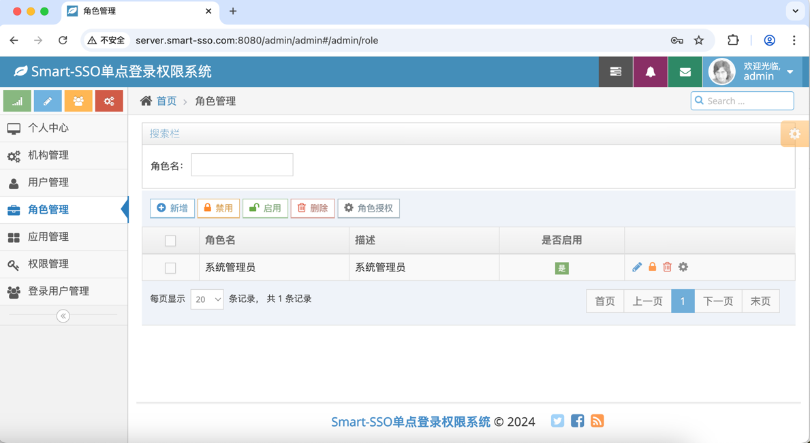

# smart-sso
[](http://opensource.org/licenses/MIT)
[](https://github.com/a466350665/smart-sso/pulls)
[](https://github.com/a466350665/smart-sso)
[](https://github.com/a466350665/smart-sso)

QQ交流群：454343484、769134727   
项目合作微信：joe466350665

## 简述
    smart-sso使用当下最流行的SpringBoot技术，基于OAuth2认证授权 + RBAC权限设计，为您构建一个轻量级、易理解、高可用、高扩展性的单点登录权限管理应用基层。

## 相关文档
- [smart-sso单点登录（一）：介绍](https://blog.csdn.net/a466350665/article/details/54140411)
- [smart-sso单点登录（二）：快速开始](https://blog.csdn.net/a466350665/article/details/79628553)
- [smart-sso单点登录（三）：接入指南](https://blog.csdn.net/a466350665/article/details/139736085)
- [smart-sso单点登录（四）：前后端分离](https://blog.csdn.net/a466350665/article/details/109742638)
- [smart-sso单点登录（五）：分布式部署](https://blog.csdn.net/a466350665/article/details/109388429)

## 为何OAuth2？
其一，从服务端申请到的accessToken，只能对单一客户端应用的资源进行访问，而非一个凭证走天下的方式，这符合OAuth2的初衷；   
*对于SSO认证授权系统而言，登录之后的第一要务就是获取登录用户当前应用的权限信息。所以，服务端必须为用户的每个客户端应用都颁发accessToken，不能凭借仅从单一客户端应用获取的accessToken，就能获得SSO认证授权中心管理的所有应用资源权限。*

其二，OAuth2的授权码模式具备双重身份验证的安全保障；   
*每个客户端应用需要接入到SSO认证授权中心，必须要有在服务端登记时颁发的应用密钥信息（ClientId、ClientSecret）才能来获得accessToken，这样做可以完成对用户身份（授权码获取阶段）和客户端应用身份（获取accessToken阶段）的双重校验保障，弥补传统仅对用户身份校验在SSO体系下的不足。*

最后，基于OAuth2的accessToken时效和刷新机制，可大大减少客户端应用和服务端的交互，支持自动续期。     
*客户端应用在获取到accessToken之后，将accessToken存储在客户端应用本地，并基于accessToken的时效做生命周期的管理，用户携带调用凭证的请求在客户端应用本地就完成校验，减少了客户端应用和服务端的不必要交互。只有当客户端应用本地校验accessToken失效后，由客户端后端向服务端发调起refreshToken请求，重新生成accessToken后返回，同时延长服务端凭证存根的时效，从而完成自动续期功能。*

## 功能说明

1. **轻量级：** 基于SpringBoot和OAuth2协议的授权码模式的极简认证授权实现；

2. **自动续约：** 使用OAuth2协议的accessToken失效机制，通过refreshToken刷新时自动更新服务端凭证时效，完成自动续约；

3. **按钮级权限控制：** 服务端对权限进行菜单和按钮分类，通过请求uri和请求方法匹配的方式实现权限按钮级控制；

4. **跨域支持：** 服务端和客户端允许在不同域名下，完成跨域的单点登录和退出机制；

5. **前后端分离支持：** 用户在前后端分离的架构下(无Cookie模式)，也能轻易实现单点登录和单点退出；

6. **分布式部署：** 服务端和客户端都支持多实例部署场景，基于redis实现分布式Token管理；

## 技术选型

| 技术                   | 版本    | 说明             |
| ---------------------- | ------- | ---------------- |
| spring-boot             | 2.5.13   | 容器 + MVC框架     |
| spring-boot-starter-data-redis    | 2.5.13   | 分布式场景Token管理  |
| spring-boot-starter-freemarker | 2.5.13   | 模板引擎  |
| springfox-boot-starter      | 3.0.0   | 文档     |
| mybatis-plus-boot-starter           | 3.5.2   | ORM框架  |
| mysql-connector-java    | 8.0.28   | 数据库驱动  |
| httpclient    | 4.5.14   | 授权码认证，客户端和服务端通信  |

## 数据库模型


## 项目结构

```lua
smart-sso
├── smart-sso-demo -- 客户端示例
├── smart-sso-demo-h5 -- 前后端分离客户端示例
├── smart-sso-server -- 单点登录权限管理服务端
├── smart-sso-starter -- 依赖装配模块
│   ├── smart-sso-starter-base -- 公用的基础依赖装配
│   ├── smart-sso-starter-client -- 客户端依赖装配
│   ├── smart-sso-starter-client-redis -- 客户端依赖装配，分布式部署场景redis支持
│   ├── smart-sso-starter-server -- 服务端依赖装配
│   ├── smart-sso-starter-server-redis -- 服务端依赖装配，分布式部署场景redis支持
```

## 模块依赖关系


<font color="red">注：</font>  
1.红色实线可以理解服务端也需要单点登录，同样是其自身的一个客户端；  
2.红色虚线表示无论是服务端还是客户端，当需要集群部署时，可选用Redis版本的依赖包来完成Token的共享存储；

## 单点登录原理


## 单点退出原理


## 效果展示
### 单点登录页


### 客户端示例登录成功页


### 服务端管控页





### 服务端管控页手机端效果


