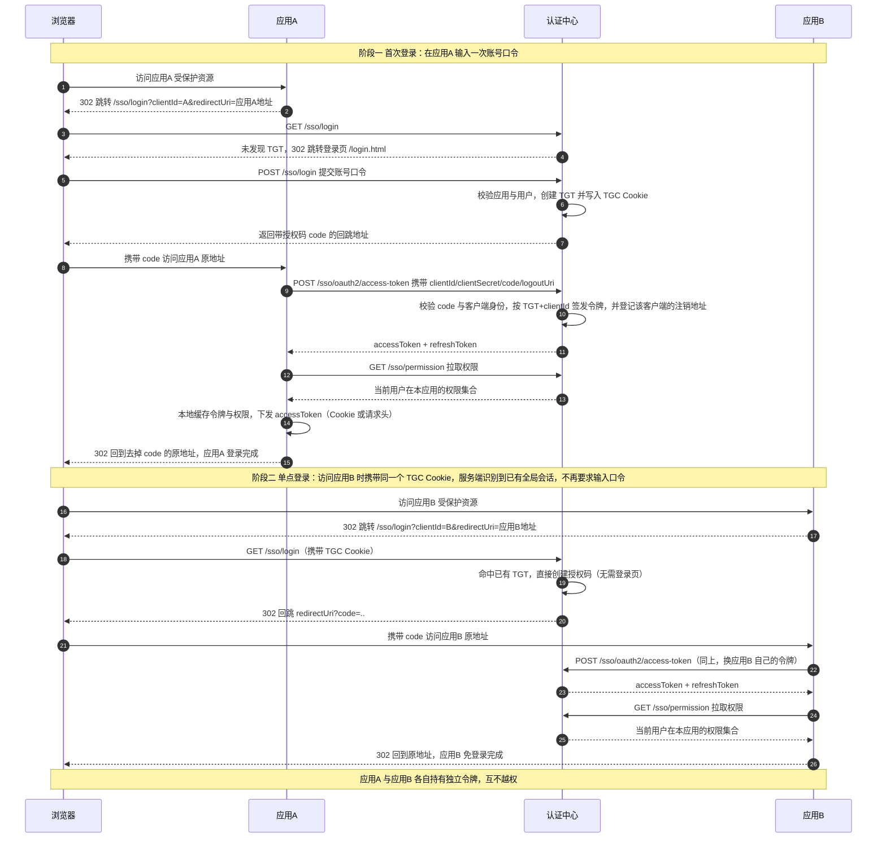
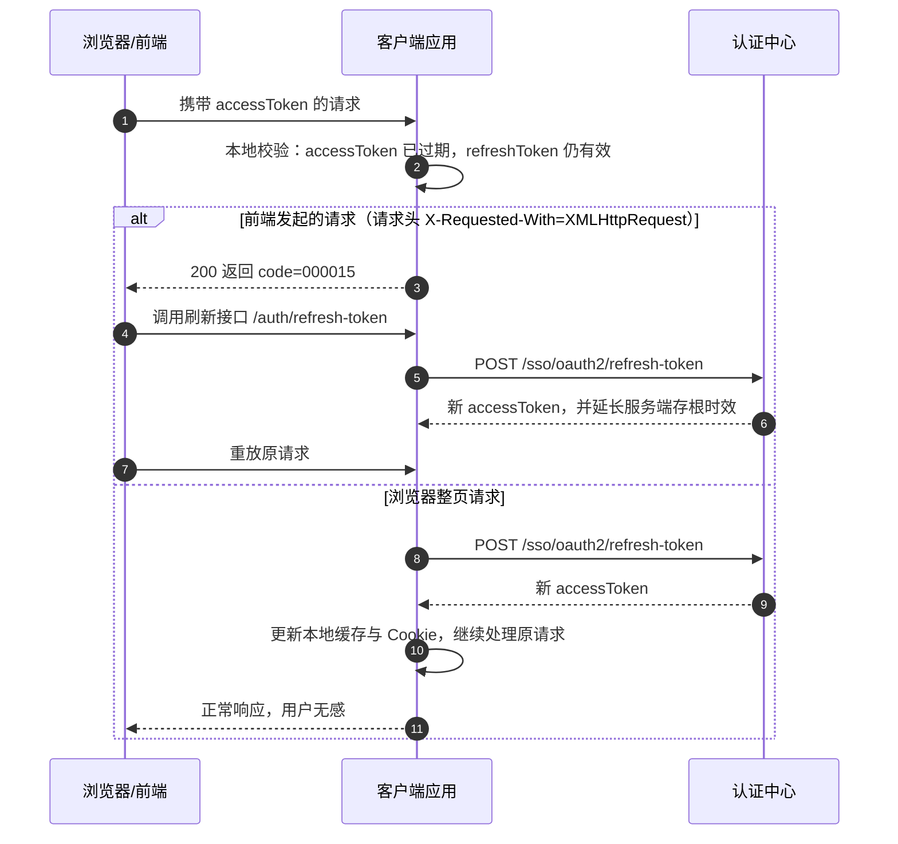
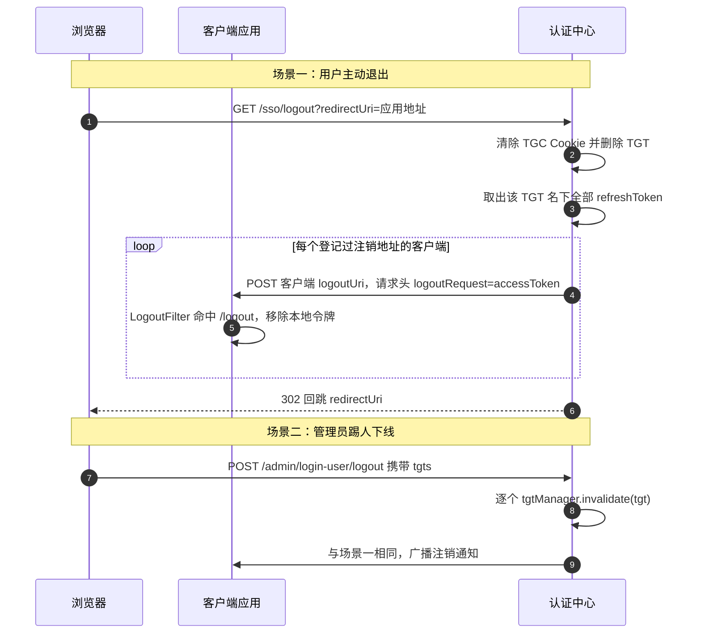

# 架构与原理

## 一、角色与凭证模型

| 凭证 | 存放位置 | 默认时效 | 说明 |
| --- | --- | --- | --- |
| `TGT`（全局会话） | 服务端 Cookie，名 `TGC` | 7200s（`smart.sso.server.timeout`） | 用户在认证中心的登录态，是单点登录与单点退出的锚点 |
| `code`（授权码） | 服务端 | 600s（`code-timeout`），**一次性** | 换取令牌的临时凭据 |
| `accessToken` | 客户端本地缓存 + 浏览器 Cookie/Header | 1800s（`access-token-timeout`） | 客户端本地校验用户身份，不回源 |
| `refreshToken` | 客户端本地缓存 | 7200s（`timeout`） | 用于续签 |

- **令牌按 (TGT, clientId) 维度签发**：同一个用户在 A、B 两个应用各有独立令牌，因此应用之间不会互相越权。
- **TokenPermission 快照**：客户端换取令牌时同步拉取该用户在本应用的权限集合并缓存，后续请求直接用快照判断，**权限变更在重新登录/刷新令牌后生效**。

## 二、单点登录时序

下面用两个应用演示完整过程：**应用A 首次登录（需要输入一次账号口令）→ 应用B 免登录（单点登录）**。



1. 浏览器访问客户端受保护资源，客户端过滤器未发现本地令牌 → `302` 跳转服务端 `/sso/login?clientId=..&redirectUri=<当前地址>`。
2. 服务端无 `TGT` → `302` 跳转登录页 `/login.html?redirectUri=..&clientId=..`；若已有 `TGT` 则直接进入第 4 步（这就是“已在 A 应用登录过，B 应用免登录”的原因）。
3. 用户在登录页提交 → `POST /sso/login`：先按 `clientId` 校验应用，再校验用户口令；通过后创建/复用 `TGT` 并写入 Cookie。
4. 服务端创建一次性授权码，`302` 回跳 `redirectUri?code=..`。
5. 客户端过滤器发现 `code` → 客户端后端携带 `clientId/clientSecret/code/logoutUri` 调服务端 `/sso/oauth2/access-token` 换取令牌；服务端同时校验代码与客户端身份，并**登记该客户端的注销地址**（用于后续单点退出）。
6. 客户端拿到令牌后本地缓存，再调 `/sso/permission` 拉取并缓存该用户在本应用的权限集合。
7. 客户端再次跳转当前地址（去掉 `code` 参数），继续访问原资源；此后请求由客户端本地校验令牌，不再回源。

## 三、令牌续签（两种模式）



当 accessToken 过期而 refreshToken 仍有效时，客户端过滤器按**请求类型**分流（不再依赖开关配置）：

| 请求类型 | 行为 |
| --- | --- |
| 前端发起的请求（`X-Requested-With: XMLHttpRequest`） | 返回 `{"code":"000015"}`，由前端自行调用刷新接口后重放请求 |
| 浏览器整页请求 | 客户端后端自动调用 `/sso/oauth2/refresh-token` 续签并更新 Cookie，用户无感 |

## 四、单点退出时序



1. 任一客户端发起退出 → 浏览器访问服务端 `/sso/logout?redirectUri=..`。
2. 服务端吊销该用户 `TGT` 下的全部令牌。
3. 服务端依据令牌中登记的 `logoutUri`，**逐个回调通知各客户端**注销本地令牌（客户端 `LogoutFilter` 处理，路径由 `smart.sso.logout-path` 配置，默认 `/logout`）。
4. 浏览器回到 `redirectUri`。

**踢人下线**复用同一套机制：「在线用户」页面按 `TGT` 调用吊销逻辑，服务端同样会回调通知所有关联客户端清除会话。

## 五、权限模型

- 权限数据按应用隔离（`sso_permission.app_id`），并以 `is_menu` 区分**菜单**与**按钮**。
- 客户端 `PermissionFilter` 用请求路径（`request.getServletPath()`）与令牌权限快照比对：
  - 命中 `permissionSet` → 放行；
  - 命中 `noPermissionSet` → 返回 `{"code":"000020"}`（无权限）；
  - **两者都不命中 → 放行**（视为该路径未纳入权限控制）。
- ⚠️ 因此**只有登记到 `sso_permission.url` 中的请求路径才真正受控**。内置管理台的权限数据登记的是 `xxx.html` 形式的页面路径；如果你希望后端接口也受控，需要把接口路径（如 `/admin/organization/list`）一并登记，并重新登录以刷新权限快照。
- 管理台的按钮级控制由前端 `permission="..."` 属性 + 用户的权限集合在浏览器侧控制（仅影响展示，不作为安全边界）。

## 六、同源与“服务端即客户端”

`smart-sso-server` 自身也是认证中心的一个客户端（有自己的 `client-id`），因此存在“自己调用自己”的场景。`smart.sso.server-url` 的处理规则：

| 配置 | 行为 |
| --- | --- |
| 配置了 `server-url` | 按独立客户端处理，所有跳转与调用都使用该绝对地址 |
| 留空，且本应用包含服务端 | **同源模式**：页面跳转使用相对路径（`/sso/login?...`），服务端之间的调用使用推导出的本机地址 `http(s)://127.0.0.1:{实际端口}{context-path}` |
| 留空，但本应用不是服务端 | **启动失败**（fail-fast），避免静默把用户跳到客户端自己的 `/sso/login` 上 |

同源模式的好处：不依赖域名/端口解析，也无需为反向代理额外配置。如需自定义本机调用地址，可显式设置 `smart.sso.internal-server-url`。

## 七、分布式部署

引入 Redis 装配模块即可让多实例共享凭证与权限：

```xml
<!-- 服务端多实例 -->
<dependency>
  <groupId>io.github.openjoe</groupId>
  <artifactId>smart-sso-starter-server-redis</artifactId>
</dependency>
<!-- 客户端多实例 -->
<dependency>
  <groupId>io.github.openjoe</groupId>
  <artifactId>smart-sso-starter-client-redis</artifactId>
</dependency>
```

不引入时使用本地内存实现（`Local*Manager` / `Local*Storage`），适合单实例与本地开发。
